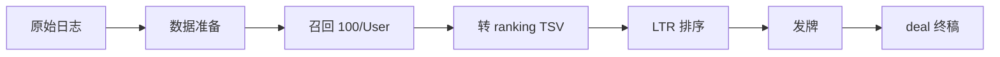

# 推荐流水线总控

> 四段流水线，一环扣一环；数据备、召回出、排序训、发牌定。

## 一、何时激活

- 用户要求「搭建推荐系统」「端到端流水线」「recsys 工作流」
- 需统筹多阶段 SKILL，或不确定从哪一阶段入手
- 本 SKILL 为**入口**，各阶段细则分见子 SKILL

## 二、流水线总览



| 阶段 | SKILL | 核心产物 |
|------|-------|----------|
| 0 契约 | `recsys-data-model` | 四元定义、目录规范 |
| 1 准备 | `recsys-data-prep` | `clean/samples_*.tsv`, `catalog/items.tsv` |
| 2 召回 | `recsys-recall` | `recall/recall_*.tsv`（100 Item/User） |
| 3 排序 | `recsys-rank` | `models/*.leaves.json`, `rank_*_scored.jsonl` |
| 4 发牌 | `recsys-deal` | `deal/deal_*.tsv` |

## 三、执行清单

复制跟踪：

```
推荐流水线 Progress:
- [ ] Stage 0: 确认四元契约（User/Item/Score/Tag）
- [ ] Stage 1: 清洗 → samples + catalog + user_qid
- [ ] Stage 2: 召回 → 每 User 100 Item
- [ ] Stage 2b: 转 rank_*.tsv + manifest
- [ ] Stage 3: leaves 训练 rank:ndcg + NDCG 评估
- [ ] Stage 3b: 组内推理 margin → scored.jsonl
- [ ] Stage 4: 发牌（去重 + Tag 控重 + Top-K）
- [ ] 验收: 校验脚本 + demo 对标
```

## 四、快速启动（仓库内 demo）

### 4.1 Go 端到端 smoke（100 Item/User，推荐）

```powershell
# 一键：合成数据 → 准备 → 召回 → 排序 → 发牌
go run ./recsys/cmd/smoke

# 自定义工作区
go run ./recsys/cmd/smoke -workspace recsys/out/smoke -recall-size 100

# 集成测试
go test ./recsys/pipeline/... -run TestSmokePipeline100PerUser -count=1
```

模块布局：

```
recsys/
  synth/      合成原始交互
  prep/       清洗、切分、catalog
  recall/     每 User 100 Item
  rankconv/   转 ranking TSV + manifest
  trainrank/  leaves rank:ndcg 训练与打分
  deal/       发牌（去重 + Tag 控重）
  pipeline/   串联各阶段
  cmd/smoke/  CLI 入口
```

### 4.2 MovieLens 对标（leaves 排序能力验真）
cd testdata && python gen_rank_movielens.py && cd ..
go run ./demos/movielens/cmd/train
go run ./demos/movielens/cmd/recommend -group 0 -topk 10
go test ./train/... -run TestRankMovieLens -count=1

# ② Smoke 最小集
cd testdata && python gen_rank_smoke.py && cd ..
go test ./train/... -run 'TestRank.*TrendVsXGBoost' -count=1
```

完整四段流水线：`go run ./recsys/cmd/smoke`（见上文 §4.1）。

## 五、子 SKILL 激活顺序

```
1. recsys-data-model   ← 先读契约
2. recsys-data-prep
3. recsys-recall
4. recsys-rank
5. recsys-deal
```

遇问题时：

- 数据格式 → `recsys-data-model`
- leaves API → `recsys-rank` / `leaves-api.md`
- 指标不达标 → 查 NDCG@k、增轮数、调 depth/lr
- 发牌多样性 → `recsys-deal`

## 六、leaves 能力边界

| 覆盖 | 不覆盖 |
|------|--------|
| LTR 训练 rank:ndcg/pairwise/listwise | 召回算法（库外实现） |
| ranking TSV 加载与嗅探 | 实时特征 / 在线学习 |
| leaves.json 训练保存与推理 | 发牌策略（库外实现） |
| NDCG/MAP 评估 | 分布式训练 / serving 框架 |
| XGB/LGB 模型加载、XGB JSON 导出 | 协同过滤 / embedding 召回 |
| Born CPU/WebGPU 训练加速 | |
| WASM/HTTP embed demo | |

**定位**：leaves 为**精排器**；召回与发牌由本 SKILL 体系在库外补全。

## 七、实现语言

一次性数据生成可 Python（参照 `testdata/gen_rank_*.py`）；**端到端 smoke 已实现为 Go**：`go run ./recsys/cmd/smoke`。

## 八、验收标准

| 检查项 | 期望 |
|--------|------|
| 数据 | 仅 User/Item/Score/Tag 四元 |
| 召回 | 每 User 100 Item |
| 排序 TSV | `data.FromFileAuto` → FormatRanking |
| 训练 | test NDCG@10 可报告 |
| 推理 | 每候选有 margin |
| 发牌 | 无 recent 重复、Tag ≤ 3（默认） |
| 回归 | `go test ./train/... -run Rank -count=1` 通过 |

## 九、目录脚手架

首次实施时创建：

```powershell
mkdir -p recsys/{raw,clean,catalog,recall,rank,models,deal,meta}
```

## 附：数据流示意

```
raw.log
  └─prep─→ clean/samples_train.tsv (User,Item,Score,Tag)
           catalog/items.tsv (Item,Tag,feat_*)
           meta/user_qid.tsv
  └─recall─→ recall/recall_train.tsv (100 rows/User)
           └─convert─→ rank/rank_train.tsv (qid,label,feat_*)
                       rank/rank_train_manifest.jsonl
  └─rank─→ models/model_rank_ndcg.leaves.json
           rank/rank_test_scored.jsonl (+Score margin)
  └─deal─→ deal/deal_test.tsv (User,Item,Tag,Score,rank)
```

详表见 [`workflow.md`](workflow.md) 与 `recsys-data-model/formats.md`。
